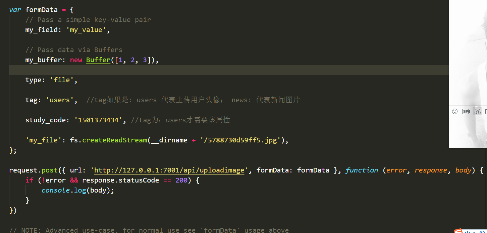

```javascript
[
    {
    "name": '登录',
    "methods": [
      "HEAD",
      "GET"
    ],
    "paramNames": ['study_code', 'pwd'],
    "path": "/api/login",
    "regexp": "/^\\/api\\/login(?:\\/(?=$))?$/",
    "stack": [
      "wrappedController"
    ]
  },
  {
    "name": '获取所有新闻信息',
    "methods": [
      "HEAD",
      "GET"
    ],
    "paramNames": [],
    "path": "/api/getnews",
    "regexp": "/^\\/api\\/getnews(?:\\/(?=$))?$/",
    "stack": [
      "wrappedController"
    ]
  },
  {
    "name": '获取自身所有的任务',
    "methods": [
      "HEAD",
      "GET"
    ],
    "paramNames": ['study_code', 'scholl_id', ],
    "path": "/api/getmyselftask",
    "regexp": "/^\\/api\\/getmyselftask(?:\\/(?=$))?$/",
    "stack": [
      "wrappedController"
    ]
  },
  {
    "name": '获取新闻评论',
    "methods": [
      "HEAD",
      "GET"
    ],
    "paramNames": ['news_id'],
    "path": "/api/getcomment",
    "regexp": "/^\\/api\\/getcomment(?:\\/(?=$))?$/",
    "stack": [
      "wrappedController"
    ]
  },
  {
    "name": '评论新闻',
    "methods": [
      "HEAD",
      "GET"
    ],
    "paramNames": ['news_id', 'content', 'time', 'user_id'],
    "path": "/api/addcomment",
    "regexp": "/^\\/api\\/addcomment(?:\\/(?=$))?$/",
    "stack": [
      "wrappedController"
    ]
  },
  {
    "name": '修改用户密码',
    "methods": [
      "HEAD",
      "GET"
    ],
    "paramNames": ['user_id', 'pwd'],
    "path": "/api/changeuserpwd",
    "regexp": "/^\\/api\\/changeuserpwd(?:\\/(?=$))?$/",
    "stack": [
      "wrappedController"
    ]
  },
  {
    "name": '修改用户描述',
    "methods": [
      "HEAD",
      "GET"
    ],
    "paramNames": ['user_id', 'desc'],
    "path": "/api/changeuserdesc",
    "regexp": "/^\\/api\\/changeuserdesc(?:\\/(?=$))?$/",
    "stack": [
      "wrappedController"
    ]
  },
  {
    "name": '上传图片(查看下方的图片)',
    "methods": [
      "POST"
    ],
    "paramNames": ['formData'],
    "path": "/api/uploadimage",
    "regexp": "/^\\/api\\/uploadimage(?:\\/(?=$))?$/",
    "stack": [
      "wrappedController"
    ]
  }
]
```
## 上传图片人接口说明:
